# آزمایش ششم - استقرار یک نرم افزار با معماری MicroService به کمک Docker

این آزمایش یک RESTful API با معماری MicroService است که با استفاده از Docker و Docker Compose مستقر شده است.

## معماری سیستم

این سیستم شامل اجزای زیر است:

1. **Load Balancer (Nginx)**: توزیع درخواست‌ها بین سرویس‌های backend
2. **Backend Services (3 instance)**: سرویس‌های backend که عملیات CRUD را ارائه می‌دهند
3. **Database (PostgreSQL)**: پایگاه داده مشترک برای تمام سرویس‌های backend

```
┌─────────────┐
│   Client    │
└──────┬──────┘
       │
       ▼
┌──────────────┐
│   Nginx      │  (Load Balancer - Port 8080)
│  (Port 80)   │
└──────┬───────┘
       │
       ├──────────┬──────────┐
       ▼          ▼          ▼
┌───────────┐ ┌───────────┐ ┌───────────┐
│Backend 1  │ │Backend 2  │ │Backend 3  │
│(Port 5000)│ │(Port 5000)│ │(Port 5000)│
└────┬──────┘ └────┬──────┘ └────┬──────┘
     │             │            │
     └─────────────┴────────────┘
                   │
                   ▼
            ┌──────────────┐
            │  PostgreSQL  │
            │  (Port 5432) │
            └──────────────┘
```

## ساختار پروژه

```
exp6/
├── backend/
│   ├── app.py              # Flask application با CRUD operations
│   ├── requirements.txt    # Python dependencies
│   └── Dockerfile          # Dockerfile برای backend service
├── nginx/
│   ├── nginx.conf          # تنظیمات Nginx load balancer
│   └── Dockerfile          # Dockerfile برای Nginx
├── docker-compose.yml      # تنظیمات Docker Compose
├── imgs/                   # تصاویر تست و نمایش API
└── README.md
```

## نحوه اجرا

### پیش‌نیازها

- Docker نصب شده باشد
- Docker Compose نصب شده باشد

### مراحل اجرا

1. کلون کردن یا دانلود پروژه:

```bash
git clone <repository-url>
cd exp6
```

2. تنظیم متغیرهای محیطی (Environment Variables):

```bash
# کپی کردن فایل نمونه
cp .env.example .env

# ویرایش فایل .env و تنظیم رمز عبور امن برای پایگاه داده
# توجه: فایل .env در .gitignore قرار دارد و به repository اضافه نمی‌شود
nano .env
```

**نکته امنیتی**: فایل `.env` شامل اطلاعات حساس مانند رمز عبور پایگاه داده است و نباید در repository قرار گیرد. فایل `.env.example` به عنوان نمونه در repository موجود است.

3. ساخت و اجرای تمام سرویس‌ها:

```bash
docker-compose up --build
```


5. مشاهده لاگ‌ها:

```bash
docker-compose logs -f
```

6. توقف سرویس‌ها:

```bash
docker-compose down
```

7. توقف و حذف volumes (حذف داده‌های پایگاه داده):

```bash
docker-compose down -v
```


## بررسی سرویس‌ها

### بررسی Container ها

```bash
docker container ls
```
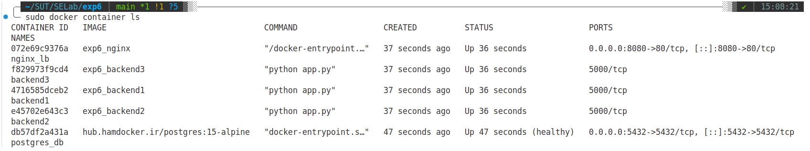

### بررسی Image ها

```bash
docker image ls
```
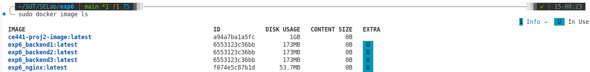

### بررسی وضعیت سرویس‌ها

```bash
docker-compose ps
```
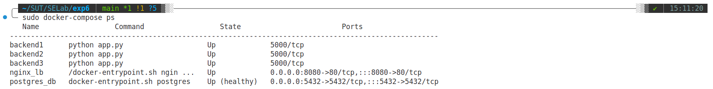


## API Endpoints

API از طریق Load Balancer در پورت 8080 در دسترس است:

- **GET** `http://localhost:8080/api/items` - دریافت تمام آیتم‌ها
- **GET** `http://localhost:8080/api/items/{id}` - دریافت یک آیتم خاص
- **POST** `http://localhost:8080/api/items` - ایجاد آیتم جدید
  ```json
  {
    "name": "Item Name",
    "description": "Item Description"
  }
  ```
- **PUT** `http://localhost:8080/api/items/{id}` - به‌روزرسانی آیتم
  ```json
  {
    "name": "Updated Name",
    "description": "Updated Description"
  }
  ```
- **DELETE** `http://localhost:8080/api/items/{id}` - حذف آیتم
- **GET** `http://localhost:8080/health` - بررسی سلامت سرویس

## مثال استفاده با curl

### ایجاد آیتم جدید

```bash
curl -X POST http://localhost:8080/api/items \
  -H "Content-Type: application/json" \
  -d '{"name": "Test Item", "description": "This is a test item"}'
```

### دریافت تمام آیتم‌ها

```bash
curl http://localhost:8080/api/items
```

### دریافت یک آیتم خاص

```bash
curl http://localhost:8080/api/items/1
```

### به‌روزرسانی آیتم

```bash
curl -X PUT http://localhost:8080/api/items/1 \
  -H "Content-Type: application/json" \
  -d '{"name": "Updated Item", "description": "Updated description"}'
```

### حذف آیتم

```bash
curl -X DELETE http://localhost:8080/api/items/1
```

## تست و نمایش API

در این بخش، نتایج تست API با استفاده از Postman نمایش داده شده است:

### 1. بررسی سلامت سرویس (Health Check)

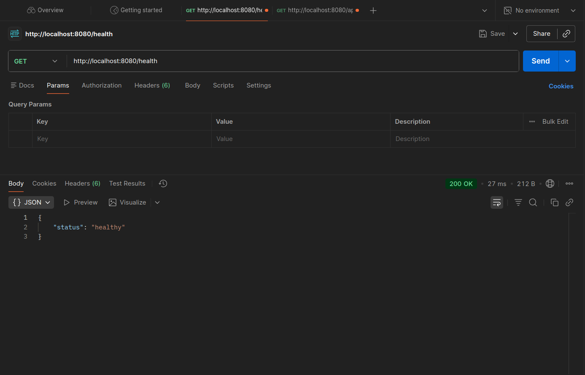

### 2. دریافت تمام آیتم‌ها (قبل از ایجاد)

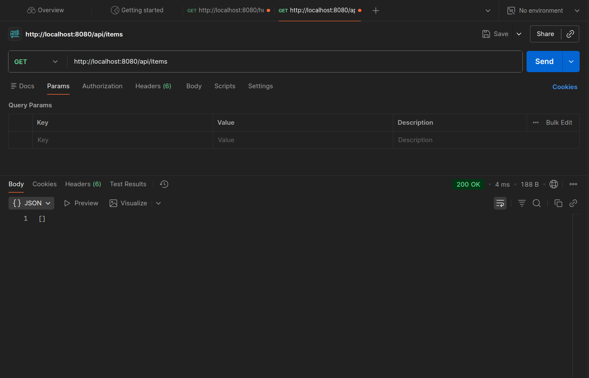

### 3. ایجاد آیتم جدید (POST)

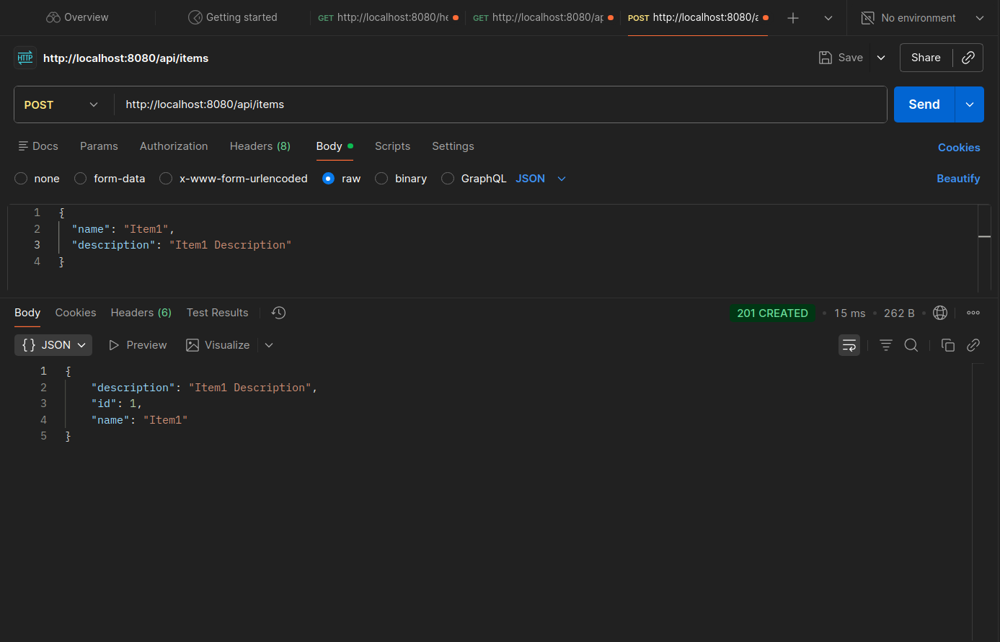

### 4. دریافت تمام آیتم‌ها (بعد از ایجاد)

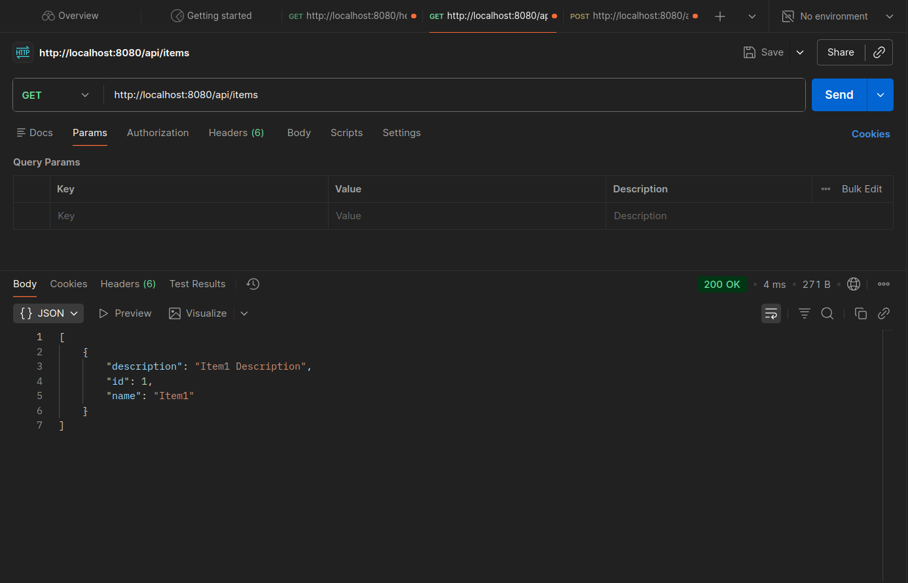

### 5. به‌روزرسانی آیتم (PUT)

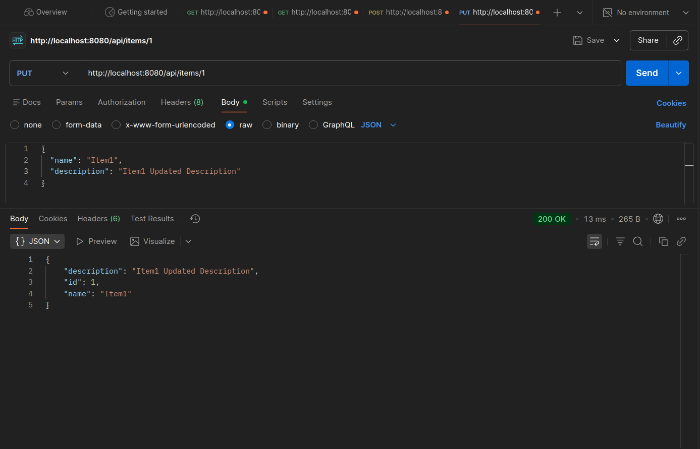

### 6. دریافت تمام آیتم‌ها (بعد از به‌روزرسانی)

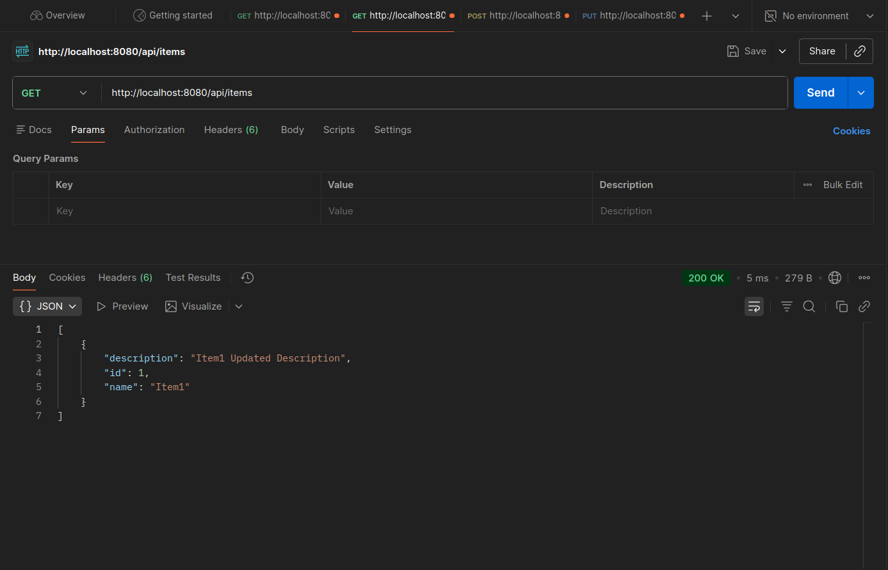

### 7. حذف آیتم (DELETE)

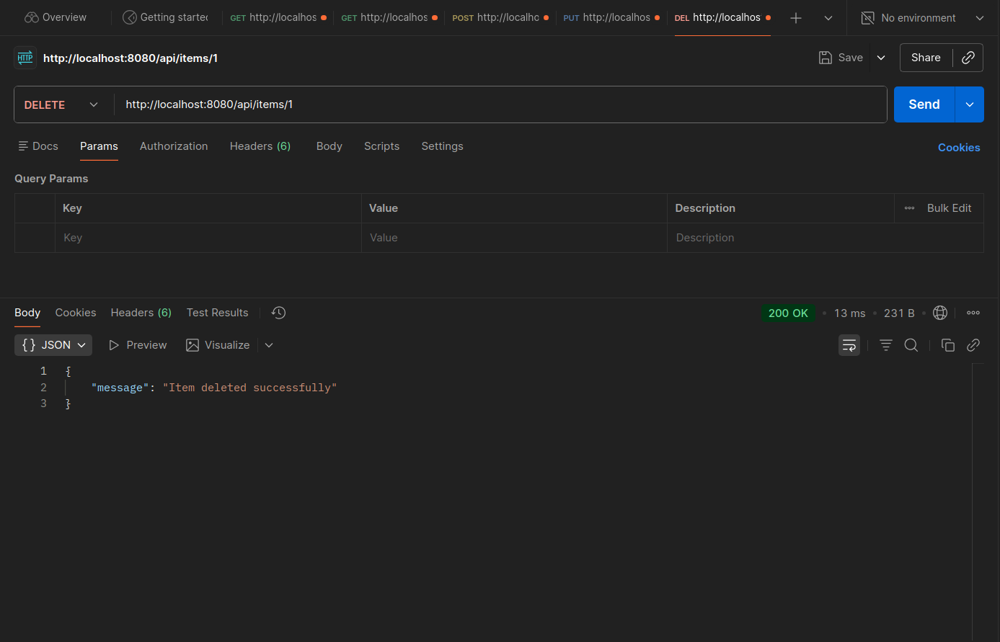

### 8. دریافت تمام آیتم‌ها (بعد از حذف)

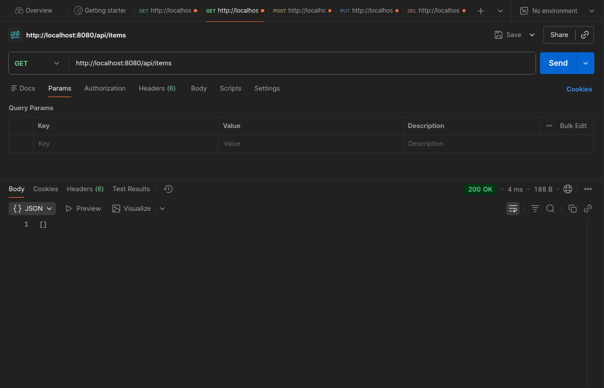

## مدیریت بار و مقیاس‌پذیری (Load Management & Scaling)

### راه‌حل پیاده‌سازی شده برای کنترل فشار روی سرویس‌های Backend

برای مدیریت افزایش بار روی سرویس‌های backend، راه‌حل‌های زیر با **تغییرات کمینه** پیاده‌سازی شده است:

#### 1. **چند نمونه Backend (Multiple Backend Instances)**

سیستم از ابتدا با **3 نمونه backend** (backend1, backend2, backend3) طراحی شده است که به صورت موازی درخواست‌ها را پردازش می‌کنند.

#### 2. **متعادل‌سازی بار (Load Balancing) با Nginx**

Nginx به عنوان Load Balancer از الگوریتم `least_conn` استفاده می‌کند که درخواست‌ها را به backend با کمترین اتصال فعال ارسال می‌کند. این باعث توزیع یکنواخت بار می‌شود.

#### 3. **معماری Stateless**

سرویس‌های backend به صورت stateless طراحی شده‌اند، یعنی:

- هیچ داده‌ای در حافظه backend ذخیره نمی‌شود
- تمام داده‌ها در پایگاه داده مشترک (PostgreSQL) ذخیره می‌شوند
- هر backend instance می‌تواند هر درخواستی را پردازش کند
- امکان افزودن instance های جدید بدون مشکل وجود دارد

#### 4. **مقیاس‌پذیری آسان (Easy Scaling)**

در صورت نیاز به افزایش بیشتر ظرفیت، می‌توانید به راحتی تعداد instance های backend را افزایش دهید:

```bash
# افزایش تعداد instance های هر backend به 2
docker-compose up -d --scale backend1=2 --scale backend2=2 --scale backend3=2
```

یا می‌توانید در فایل `docker-compose.yml` تعداد instance های backend را افزایش دهید.

**نکته مهم**: با این معماری، پایگاه داده می‌تواند فشار را تحمل کند و تمام بار روی سرویس‌های backend توزیع می‌شود. این راه‌حل با **تغییرات کمینه** (فقط چند backend instance و یک load balancer) مشکل افزایش بار را حل می‌کند.

## پرسش‌ها

### 1. مفهوم stateless به چه معناست؟

مفهوم **Stateless** به معنای این است که سرویس یا برنامه هیچ اطلاعات حالت (state) را در خود نگه نمی‌دارد. هر درخواست مستقل از درخواست‌های قبلی پردازش می‌شود و سرویس برای انجام عملیات به اطلاعات ذخیره شده در خود متکی نیست.

**استفاده در این آزمایش:**

در این پروژه، سرویس‌های backend ما stateless هستند:

1. **عدم ذخیره حالت در حافظه**: هیچ داده‌ای در حافظه سرویس‌های backend ذخیره نمی‌شود. تمام داده‌ها در پایگاه داده PostgreSQL ذخیره می‌شوند.

2. **قابلیت مقیاس‌پذیری**: به دلیل stateless بودن، می‌توانیم به راحتی تعداد instance های backend را افزایش دهیم. هر instance می‌تواند هر درخواستی را پردازش کند بدون نیاز به اطلاعات از instance دیگر.

3. **متعادل‌سازی بار (Load Balancing) موثر**: Nginx می‌تواند درخواست‌ها را به هر کدام از instance های backend ارسال کند، زیرا همه آن‌ها یکسان عمل می‌کنند و به همان پایگاه داده مشترک متصل هستند.

4. **قابلیت Restart**: اگر یک instance از backend از کار بیفتد یا restart شود، داده‌ها از دست نمی‌روند چون در پایگاه داده ذخیره شده‌اند.

این معماری باعث می‌شود سیستم ما قابل اعتماد‌تر، مقیاس‌پذیرتر و قابل نگهداری‌تر باشد.